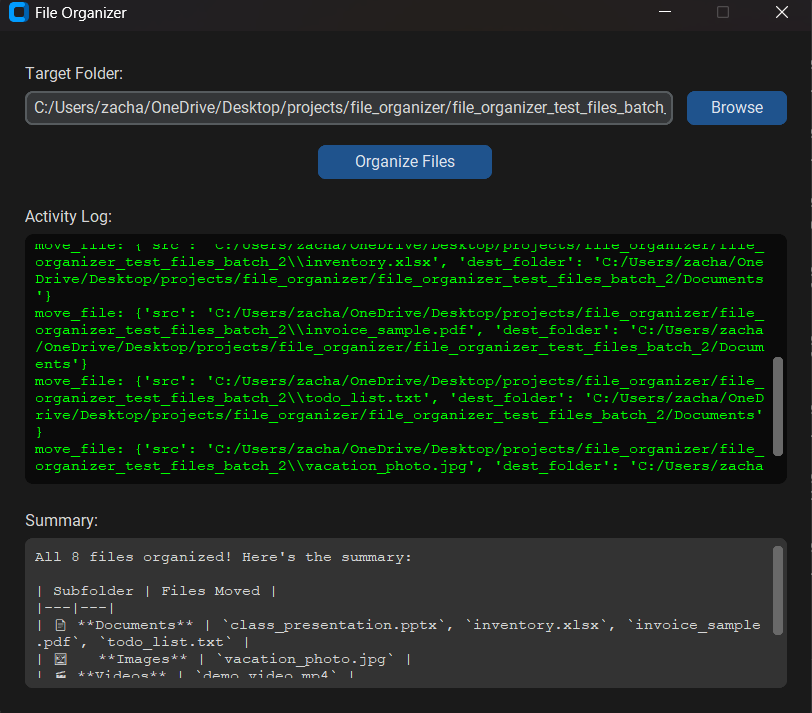

# AI File Organizer

A desktop application that uses Claude AI to automatically organize files into categorized subfolders based on file type. Built with Python and CustomTkinter.

## Features

- **AI-powered** — Uses Claude to intelligently sort files into categories like Documents, Images, Code, Videos, Archives, and more
- **Desktop app** — Native Windows application with a clean dark UI, no browser needed
- **Live activity log** — Watch files being organized in real time
- **Safety first** — Path validation blocks system directories, confirmation dialog prevents accidental runs
- **Standalone exe** — Can be packaged as a single executable with PyInstaller

## Demo



## Getting Started

### Prerequisites

- Python 3.12+
- An [Anthropic API key](https://console.anthropic.com/)

### Installation

1. Clone the repo
```bash
git clone https://github.com/raperzac05-crypto/AI-File-Organizer.git
cd AI-File-Organizer
```

2. Create and activate a virtual environment
```bash
python -m venv venv
venv\Scripts\activate
```

3. Install dependencies
```bash
pip install -r requirements.txt
```

4. Create a `.env` file in the project root
```
ANTHROPIC_API_KEY=your_key_here
```

5. Run the app
```bash
py desktop_app.py
```

## Building the Executable

```bash
pip install pyinstaller
py -m PyInstaller --onefile --noconsole --name "File Organizer" desktop_app.py
```

The exe will be in the `dist/` folder. Place your `.env` file in the same folder as the exe before running.

## Project Structure

```
file_organizer/
├── desktop_app.py       # CustomTkinter desktop app
├── organizer.py         # Claude AI agent + tool logic
├── main.py              # FastAPI backend (browser version)
├── ui.html              # Browser frontend
├── app.js               # Frontend JavaScript
├── format.css           # Frontend styles
├── requirements.txt
├── .env                 # API key (not committed)
└── .gitignore
```

## How It Works

1. User selects a folder
2. Claude lists all files in the folder
3. Claude checks file metadata (extension, size, modified date)
4. Claude moves each file into a sensible subfolder
5. A summary of all moves is displayed when complete

## Technologies

- [Python](https://www.python.org/)
- [Anthropic Claude API](https://www.anthropic.com/)
- [CustomTkinter](https://github.com/TomSchimansky/CustomTkinter)
- [FastAPI](https://fastapi.tiangolo.com/)
- [PyInstaller](https://pyinstaller.org/)

## License

MIT
